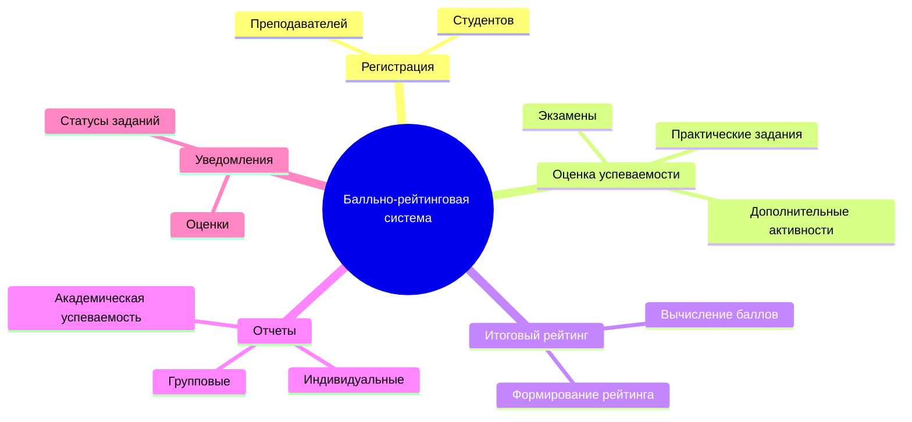
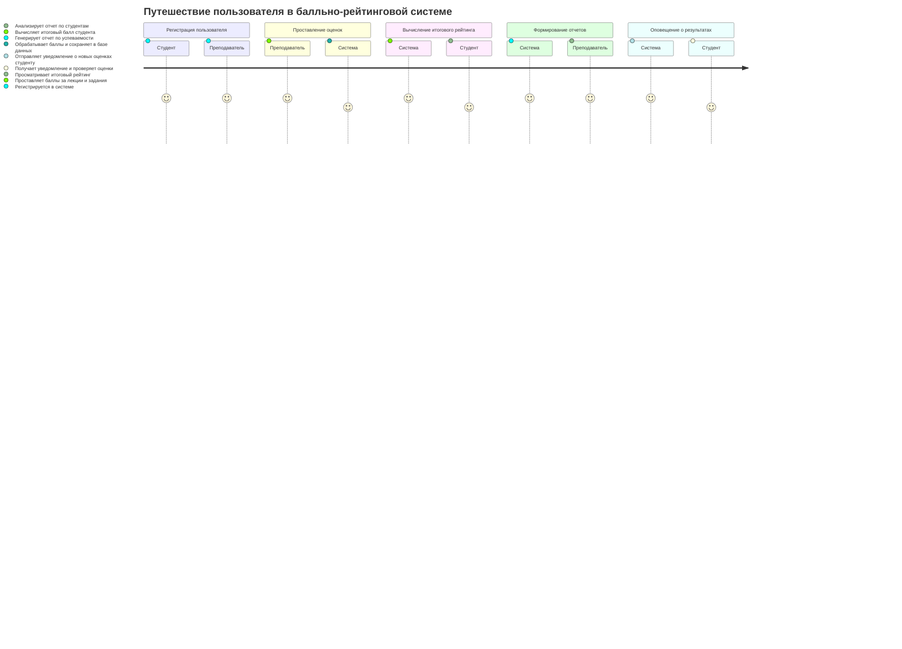
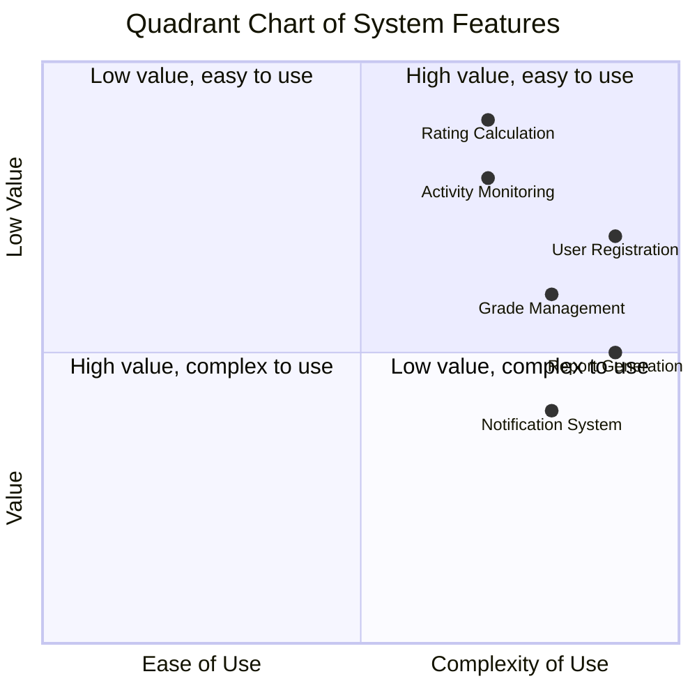
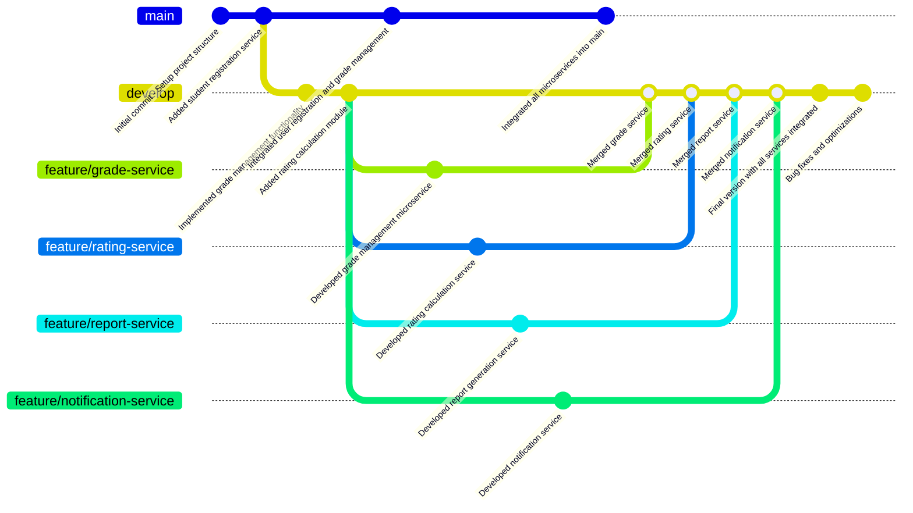

# Веб-приложение для управления киберспортивными соревнованиями

## Описание проекта
Данный проект представляет собой веб-приложение для реализации балльно-рейтинговой системы оценки успеваемости студентов. Система предназначена для учета и оценки знаний студентов в учебных заведениях с помощью баллов, которые накапливаются за различные виды деятельности, такие как контрольные работы, лекции, экзамены, практические задания и участие в дополнительных активностях.
Технологический стек: **Spring Boot** для серверной части и **React** для фронтенда.

---

## Диаграммы

### 1. Диаграмма структуры функциональных возможностей (Mind Map)

Эта диаграмма отображает основные функции системы, включая регистрацию пользователей, управление оценками, вычисление итогового рейтинга, отчеты и уведомления.

### 2. Диаграмма путешествия пользователя (User Journey)

Эта диаграмма иллюстрирует путь пользователя (студента или преподавателя) в системе — от регистрации до получения отчетов о результатах.

### 3. Квадрантная диаграмма (Quadrant Chart)

Эта диаграмма показывает распределение функциональных возможностей системы по важности и сложности.

### 4. Диаграмма истории разработки (Git Graph)

Эта диаграмма демонстрирует этапы разработки приложения, включая создание микросервисов для оценки, регистрации пользователей, генерации отчетов и системы уведомлений.

